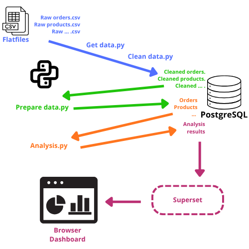

## Conseil pour le workflow

## Suggestions pour vos analyses

* Gérer les NaN (évident…)
* Gérer les valeurs incohérentes. Commencez par les dates par exemple, qui sont facile à identifier : y a-t-il des avis qui précèdent la réception d’un colis, voire la date de commande ? Des livraisons qui précèdent la commande ? etc. Vérifier. Des paiements trop élevés ou trop faibles, etc.	

- N’hésitez pas à  faire un ERD pour y voir plus clair (par exemple sur https://dbdiagram.io/home/)
- Commencer par regarder combien de clients, vendeurs, commandes, produits, avis **uniques** il y a
- Combien d’avis y a-t-il par commande ? Combien devrait-il en avoir ?
- Combien y a-t-il d’avis **manquants** ? Combien de commandes **non livrées** ? Combien de commandes en **retard** ?
- **Créez des dataframes/tables qui rassemblent des données pertinentes.** 
  * Par exemple, pour les **commandes**, les colonnes/features suivantes peuvent être pertinentes : order_id (PK), durée de livraison, durée de livraison prévue, statut de la commande, score (avis), nombre de produits, nombre de vendeurs, prix, frais de port, prix total, distance, etc. (rajoutez toutes les features qui vous semblent pertinentes pour caractériser une commande).  Essayez de réfléchir à ce genre de table aussi pour les **produits**. Note : vous pouvez aussi calculer des délais de livraison, prix, avis, etc. pour les produits, et en même temps retenir des features plus spécifiques (volume, taille, nombre de fois où un produit est commandé, etc.). Puis de même pour les **clients**, les **vendeurs**, etc.
  * Certaines de ces features devront être **calculées** : il faudra faire des `.merge()`, des `.groupby()` (ou `.map()`, ou `.apply()`, `.agg()` en fonction des opérations souhaitées…)
  * Vous pouvez aussi **segmenter** certaines features : par exemple, pour les avis plutôt que garder une échelle de 5, vous pouvez créer une feature bon/neutre/mauvais (segmentation). Mais comment segmenter ? Considérer qu’un avis positif c’est au-dessus de 4, 3 ça commence à être mauvais ? (et donc 4 neutre ?). Juste comparer les valeurs extrêmes (5 vs 1 étoile) ? 
  * Pour chaque feature que vous créez vérifiez que ça apporte bien quelque chose à votre analyse (si votre segmentation n’apporte rien, elle est inutile/non-pertinente). 
  * plus technique : dans la table **geolocalisation** vous pouvez obtenir la latitude et la longitude. Pour calculer des distances à partir de ces données, n’oubliez pas que la terre est ronde ! On ne va donc pas se contenter d’une distance euclidienne (dans un plan) mais on devrait plutôt calculer ce que l’on appelle [la distance de haversine](https://fr.wikipedia.org/wiki/Formule_de_haversine) pour avoir la distance entre deux points sur une sphère. Peut-être trouverez vous un moyen de calculer les distances routières (API ? )
  * pour rester dans la géolocalisation : le Brésil est un État fédéral. Peut-être chaque État a sa spécificité, ses difficultés ? Voir si en analysant État par État il y a des différences, ou à une autre échelle, si dans les grandes villes il y a des patterns particuliers vs. « petites » villes ou campagne ?
- quand vous avez créé une table cohérente, commencez à chercher des **tendances** : toujours intéressant de regarder les distributions des features les plus importantes à vos yeux (prix, distance, avis…), et de calculer une matrice de corrélation/heatmap
- pensez ensuite à faire des **régressions** :  simple dans un premier temps, par exemple : temps d’attente vs. avis
- vous pouvez ensuite faire des régressions multivariées qui, comparées aux régressions simples, permettent de contrôler l’effet de certains paramètres. 
  Exemple : 
  * temps d’attente -> avis 
    (donne un paramètre = pente)
  * temps prévu d’attente -> avis
    (donne un paramètre = pente)
  * puis temps d’attente + temps prévu d’attente -> avis
    (on a deux autres paramètres = chacun indique l’influence d’un paramètre quand l’autre est tenu constant, ça permet de voir lequel, *toutes choses égales par ailleurs* impacte le plus, positivement ou négativement, les avis)
- si vous faites une analyse, interprétez les paramètres (comment traduire ces valeurs chiffrées ?), et soyez attentifs à la significativité, confiance que vous pouvez avoir dans ces analyses, R etc.
- attention à la fuite de données (intégrer à la régression une feature qui est dérivée de votre variable expliquée) et à la colinéarité
- pensez à standardiser si vous voulez comparer la taille d’effet de features qui sont dans des unités différentes
- la procédure classique : faites une régression avec toutes les variables/features candidates (standardisées) et repérez celles qui ont le plus d’effet. Tracer un graphe pour comparer les valeurs des paramètres (ordonnés/triés)
- n’oubliez pas l’analyse des résidus !!!
- calculez le VIF quand vous considérez plusieurs features à la fois
- posez vous des questions sur les mécanismes à l’œuvre : est-ce qu’en prenant en compte l’aspect psychologique, vous pensez qu’un client pourrais avoir tendance à être plus sévère quand il a achète quelque chose de cher ? Dans ce cas le prix devrait avoir un effet sur les avis. 
- toujours dans la segmentation, quelles sont les catégories de produit les plus vendues ? il peut être pertinent de créer un dataframe/table avec les principales features par catégories (prix, temps d’attente, avis, quantité vendues, volume…)
- vous pouvez vous poser des questions comme : comment améliorer la satisfaction client (avis = trouver les features qui impacte plus les avis), mais aussi comment améliorer les délais de livraison (ce qui a un impact sur les avis semble-t-il)… êtes vous capable de faire de bonne prédiction des délais de livraison ?
- les avis sont des valeurs discrètes entre 1 et 5, et nous pouvons aussi les segmenter en d’autres catégories (bon / neutre / mauvais par exemple). C’est un cadre parfait pour des régressions logistiques (multivariées). Est-ce que des features différentes influences certaines catégories d’avis plus que d’autres catégories ? (en gros une features peut-elle prédire plus fortement un avis à 1 étoile qu’un avis à 5 étoiles ? et vice-versa pour une autre feature ?)

